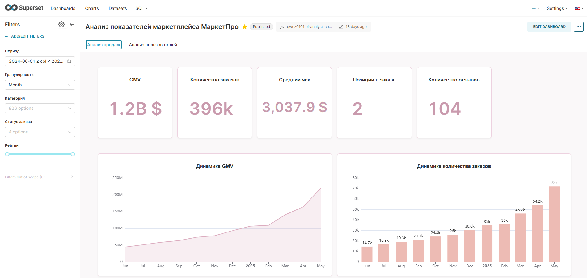
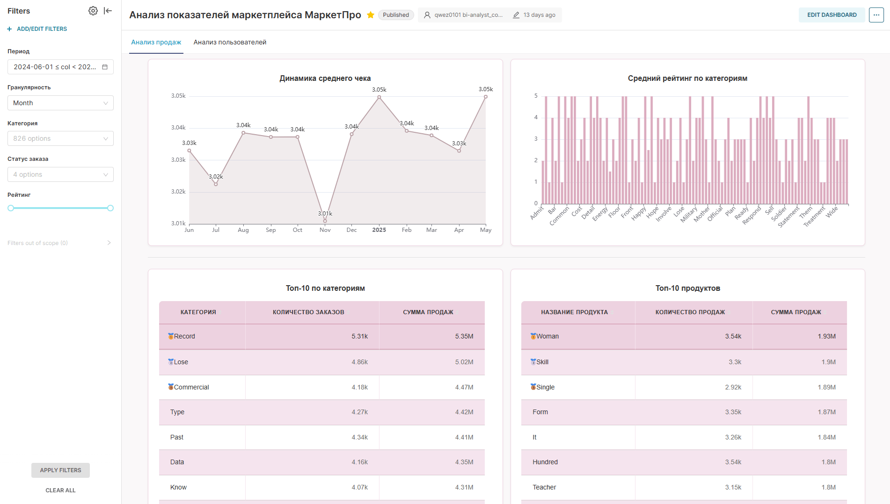
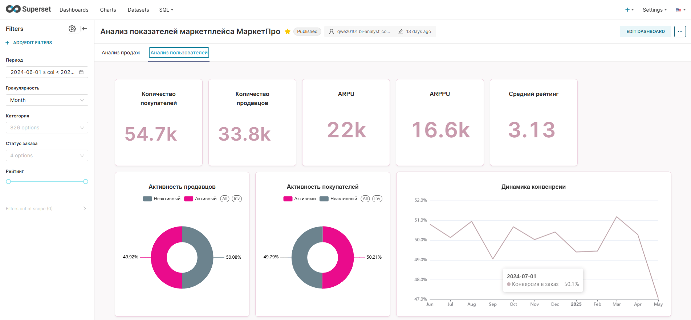
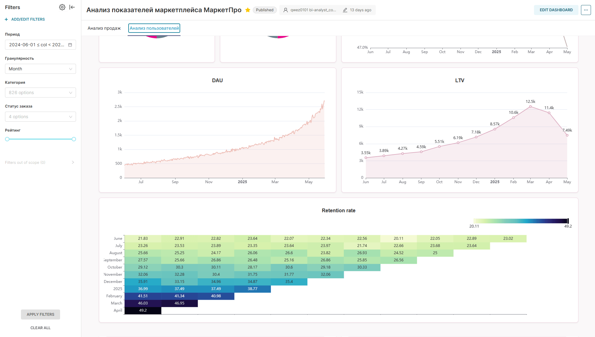

# Аналитический дашборд для маркетплейса

## Задача
Разработать аналитический дашборд для мониторинга ключевых метрик маркетплейса: объём заказов, выручка, эффективность рекламных кампаний.

## Данные
- 7 связанных таблиц
- 500 000+ заказов
- Период: июнь 2024 — май 2025

## Стек
SQL (PostgreSQL), Python (pandas), Apache Superset

## Что сделано
1. Сбор требований от заказчика
2. Предобработка данных: очистка дубликатов, обработка пропусков, исправление ошибок
3. Исследовательский анализ (EDA): распределения, корреляции, визуализация
4. Расчёт ключевых метрик
5. Разработка дашборда с фильтрами и визуализациями
6. Оформление интерфейса с помощью CSS
7. Подготовка пользовательской документации

## Результат

Дашборд состоит из двух вкладок с интерактивными фильтрами
(период, гранулярность, категория, статус заказа, рейтинг).

### Анализ продаж

- 396k заказов на 1.2B $ за период, средний чек ~3.0k $.
- Устойчивый рост: заказы ×5 за год (14.7k → 72k в месяц), GMV с ~45M до ~220M.
- Рост обеспечен количеством заказов: средний чек стабилен весь период.

- Выручка концентрируется в топ-категориях: Record, Lose и Commercial
  лидируют по заказам и сумме продаж.

### Анализ пользователей

- 54.7k покупателей и 33.8k продавцов, около половины активны.
- Конверсия в заказ стабильна на уровне ~50%.

- DAU вырос с ~500 до 2.5k+ за год.
- Retention новых когорт выше ранних (40–49% против 20–25%) —
  платформа становится «липче».
- Снижение LTV в конце периода объясняется тем, что свежие когорты
  ещё не дозрели до полного цикла покупок.
  
Код анализа — в [Project-marketplace.ipynb](Project-marketplace.ipynb).
